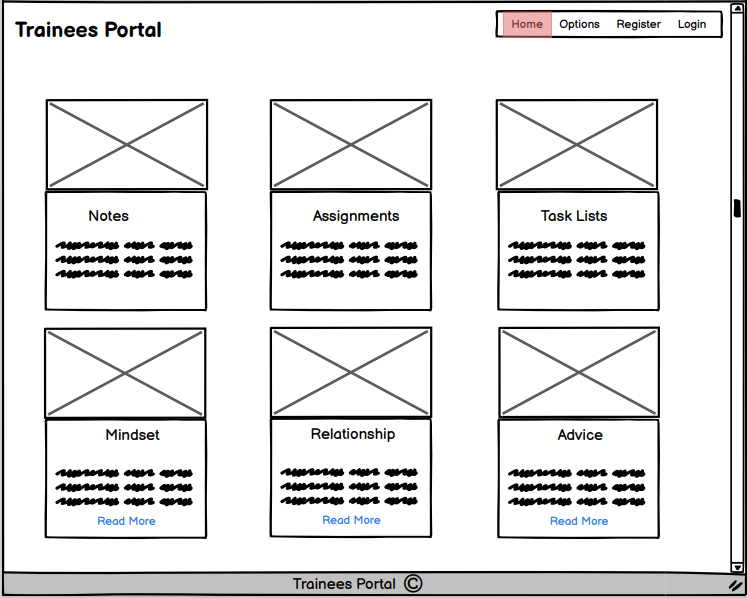
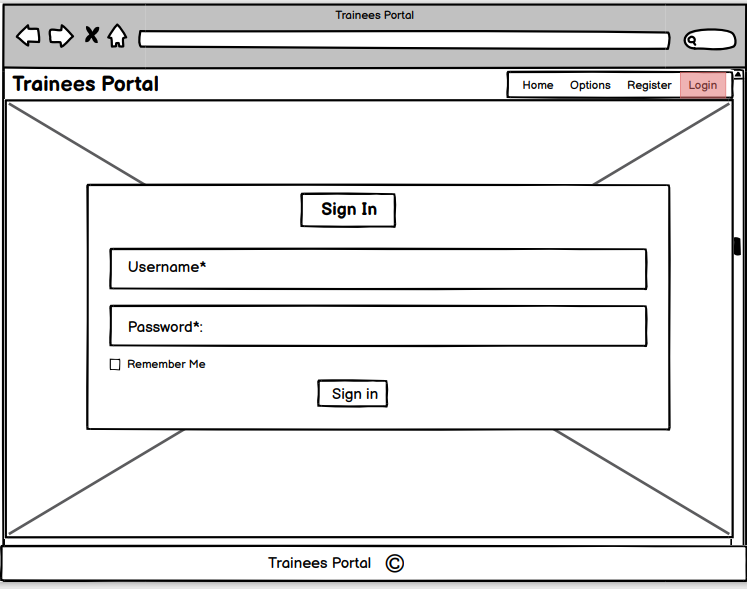
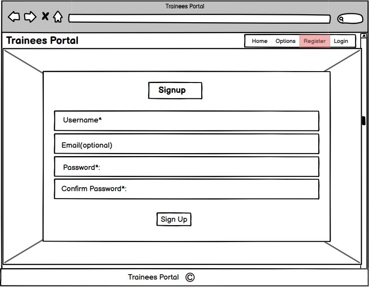
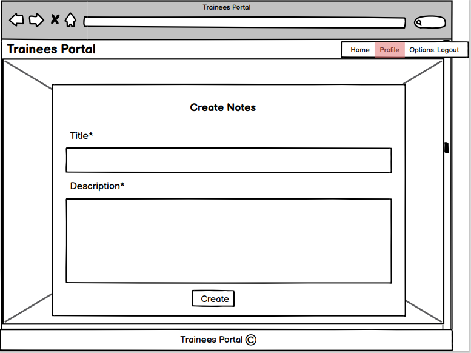
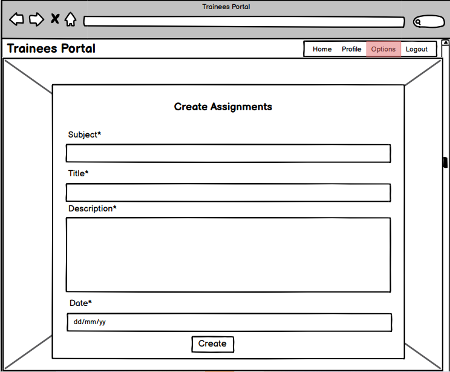
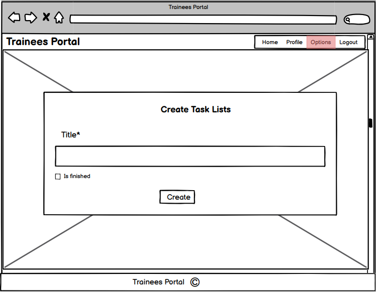
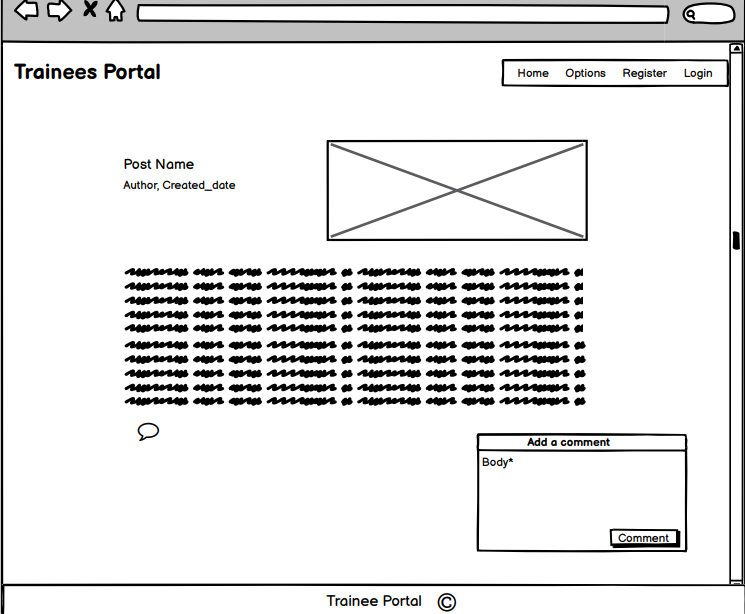
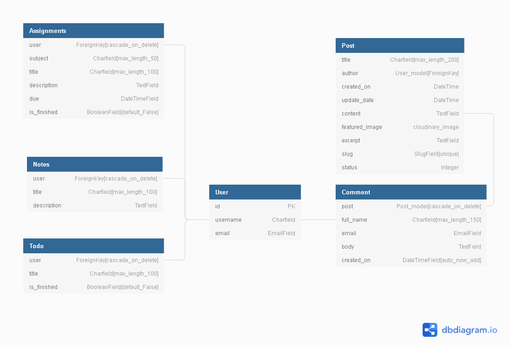

# Trainees Portal

The live website can be viewed [here](https://traineesportal.herokuapp.com/)

# Table of contents
1. [Introduction](#introduction)
2. [UX](#UX)
    * [User Stories](#User-Stories)
    * [Development Planes](#development-planes)
        * [Strategy](#Strategy)
         * [Skeleton](#Skeleton)
            * [Wireframes](#Wireframes)
            * [Database Schema](#Database-Schema)
        * [Structure](#Structure)
            * [Existing Features](#Existing-Features) 
            * [Features Left To Implement](Feature-Left-To-Implement)
    * [Design](#Design)
        *  [Colors](#Colors)
        * [Typography](#Imagery)
        * [Imagery](#Imagery)

3. [Technolgies Used](#Technologies-Used)        
4. [Testing](#Testing)
5. [Issues and bugs](#issues-and-bugs)
6. [Deployment](#Deployment)
    * [Deployment Steps](#Deployment-Steps) 
    * [Making a clone to run locally](#Making-a-clone-to-run-locally)
    * [How to Fork the respository](#How-to-Fork-the-Respository)
7. [Languages Used](#languages-used)
8. [Credits](#Credits)
    * [Media](#Media)
    * [Content](#Content)
    * [Code](#Code)
9. [Acknowledgements](#Acknowledgements)

---

# INTRODUCTION

Trainee Portal is a site that facilitate all trainees to be more organised with all tasks they should have on their internship. Since during an internship, trainees very often have several notes to take about work operations, daily tasks to do as well as assignments to test their knowledge. On this, in Trainee Portal, trainees can write down all their notes, tasks and assignments which are well kept and protected. They will be able to update them whenever they want, as well as delete them once the task or assignment is finished. 

Trainee Portal also has some blog posts, which are beneficial to the trainees before, during and even after their work placement. Since these blog posts teach them to work on their mindset, their relationship during the internship, some tips on how to behave and many more. On these blog posts, trainees can read and leave comments.

Trainees must first sign up or register in order to create their information, to comment, and also to view their profile with all due assignments and tasks.

There are many other site features which will be discussed in depth later on in this document.

This is the fourth of five milestone projects that the developer is required to complete as part of their full web development course at the Code Institute.

# UX

## User Stories

### First Time User goals

* As a first time user, I want to see the main functions of the site
* As a first time user, I want to be able to easily navigate throughout the site to find content
* As a first time user, I want to read the blog post and see the comment

### Returning User Goals

* As a returning user, I want the site to be responsive across all devices.
* As a returning user, I want to be able to create an account easily.
* As a returning user, I want to be able to creates notes, assignments and tasks
* As a returning user, I want to be able to see my profile

### Frequent User Goals

* As a frequent user,  I want to be able to login
* As a frequent user, I want to see my notes, assignments and tasks
* As a frequent user, I want to update my assignments and tasks
* As a frequent user, I want to delete my unwanted data
* As a frequent user, I want to check to see there are any blog posts

### User Stories - Admin Only
* As a site administrator, I want to be able to create, update and delete tasks, notes, assignments, blog posts.
* As a site administrator, I want to be able to edit or delete coomments that may contain inappropriate content. 

## Development Planes

### Strategy

**The Ideal User of this site:**

* is someone who wants to start a work placement
* is someone who wants to start a traineeship
* is someone who has just started a traineeship or work placement

### Skeleton

#### Wireframes

Wireframes were created using [Balsamiq wireframes](https://balsamiq.com/)

The wireframe mockup links can be found below:

* Home Page

* Login Page

* Register Page

* Notes Page

* Assignments Page

* Task lists Page

* Post 1 Page

#### Database Schema

### Structure

#### Existing Features

 1. Features on all pages

    * Navbar
        - The navbar contains a conventionally placed logo at the top left of the page, if the user is not register, there are three buttons: Home, Register and login

        

        - If the user login, there are four buttons: Home, Profile, Options which contains three personal options of the site and Logout.

        

    * Footer
        - The footer contains the copyright

        

2. Home Page Features

    * There are six boxes representing the different options of the site: Notes, assignments, task lists and as a blog: Mindset, Relationship and Advice. They are all represented with a picture and a description.

    

3. Register Page Features

    * The Register button directs the user to the sign in page which asks the user to fill their username, email(optional), set the password and confirm it.

    

4. Log In Page Features

    * The login button directs the user to the login page which asks the user to fill their username and password.

    

5. Profile Page Features

    * A profile page is automatically created for the user once they have registered with the site. The profile form is automatically updated with the due information that the user put in the tasks and assignments. The user can update this information. Beneath the profile form there is a table with the user's personal information. There are tasks and assignments buttons that lead the user directly to the options wanted.

    

6. Log Out Features

    * The log out button directs the user to the signout page which asks the user to confirm that they wish to sign out.

    

7. Notes features

    * There is a form that the user should fill to create note and once the note created, it will appear above the form.

    

8. Assignments features

    * There is a form that the user should fill to create assignment and once the assignment created, it will appear in the table above the form.

    

9. Task lists features

    * There is a form that the user should fill to create task and once the task created, it will appear in the table above the form.

    

10. Blog posts features

    * There are three blog posts, they contain picture, content and comment arrea.

    

11. Message features

    * Everytime that the user makes a successfully operation, there is successfully message appears at the top.

    

12. Features exclusive to Admin

* Only the Admin can edit/delete all content on the site. 

## Features Left To Implement

The scope of this project was quite large at its inception and decisions had to be made to sacrifice certain content and features in order to meet the submission deadline. The following features will be explored and implemented at a later date:

* ABOUT page was a potential feature in which users would be able to find out more information about Trainess Portal and also about the staff and the purpose of the site. All this data would be contained in its own model which would be modified when necessary by the site administrator through the site management tab and in the admin view.

* Like, will be a attractive feature, so that user can see how many person likes the page and make blog posts more attractive.

* Alert message, whenever that user want to delete the data, he will nee to confirm the action.

---

[Go to top](#introduction)

# Technolgies Used

1. [Python](https://www.python.org/) 
    The following Python modules were used on this project:
    - asgiref==3.4.1
    - cloudinary==1.26.0
    - dj-database-url==0.5.0
    - dj3-cloudinary-storage==0.0.6
    - Django==3.2.8
    - django-allauth==0.45.0
    - django-crispy-forms==1.13.0
    - django-summernote==0.8.20.0
    - gunicorn==20.1.0
    - oauthlib==3.1.1
    - psycopg2==2.9.1
    - PyJWT==2.3.0
    - python3-openid==3.2.0
    - pytz==2021.3
    - requests-oauthlib==1.3.0
    - sqlparse==0.4.2
2. [Django](https://docs.djangoproject.com/en/3.1/)
    - Django was used as the main python framework in the building of this project.
3. [jQuery](https://jquery.com/)
    - This framework was used to create some of the site's interactive functions.
4. [Gitpod](https://gitpod.io)
    - This project was built using Gitpod as the IDE.
5. [Github](https://github.com/)
    - Github was used for online version control and storing files and documents.
6. [Heroku](https://id.heroku.com/)
    - Heroku was used as a cloud-based platform to deploy this site.
7. [Google fonts](https://fonts.google.com/) 
    - The font styles used on this website were chosen from Google fonts.
8. [Bootstrap](https://getbootstrap.com/docs/4.4/getting-started/introduction/)
    - Various aspects of this website were structured using Materialize.
    - Bootstrap was used to make this website responsive
9. [Fontawesome](https://fontawesome.com/)
    - The icons used on this page were found in Fontawesome.
10. [Heroku Postgres](https://www.heroku.com/postgres)
    - Heroku was used as the database for this project in production mode after deployment to Heroku.
11. [Cloudinary](https://cloudinary.com/)
    - Cloudinary was used to store all medias of this site.    
12. [Balsamiq](https://balsamiq.com/)
    - The wireframes for this project were created using Balsamiq.
13. [Freeformatter- CSS beautifier](https://www.freeformatter.com/css-beautifier.html)
    - This was used to format the CSS stylesheet.
14. [Freeformatter- HTML formatter](https://www.freeformatter.com/html-formatter.html)
    - This was used to format each HTML page
15. [PEP8online](http://pep8online.com/)
    - PEP8 online was used to make sure all python code was pep8 compliant.
16. [Google DevTools](https://developers.google.com/web/tools/chrome-devtools) 
    - Google Dev Tools was extensively used throughout the project for various styling and testing purposes. Its lighthouse feature was used as one of the main testing tools for this project.
17. [Favicon.io](https://favicon.io/) 
    - This was used to create the site's favicon.
18. [Am I Responsive](http://ami.responsivedesign.is/)
    - This was used to test the responsiveness of the site and also to create the mock-up image presented at the start of this document.
19. - [Dbdiagram.io](https://dbdiagram.io/home)
    - Dbdiagram.io was used to create the Database Schema presented in this document.
20. [Coolors.co](https://coolors.co/)
    - Coolors.co was used to create the project's color palette.
21. [StackOverflow](https://stackoverflow.com/)
    - Stack Overflow was used as a general reference resource.

---

[Go to top](#introduction)

# Testing

Testing information can be found in a separate [testing file](https://github.com/Georgette-Lumbe/traineesportal/blob/main/TESTING.md).

# Issues and bugs

The developper met some issues during the development of the website, below are the issues, bugs and solutions that the developer has encountered:

1. Git push Issue

    * The developer met an error while trying to push commit changes to github.
    

    * To achieve this, the developer consulted the Code Institute Tutor Support. The problem was that the developer pushed a commit changes directly to github and gitpod breaks.

    * The developer did these steps to fix the problem:

    `git add`
    `git remote -v`
    `git log`
    `git status`
    `git log`
    `git add` `git commit -m " any message`
    and `git push origin main --force`

2. Django admin

    * The django admin was working perfectly but without any style
    

    * The developer consulted the Code Institute Tutor Support, to achieve this. The problem was that DEBUG was equal to True in settings.py file. To resolve it, the developer put DEBUG = FALSE and remove DISABLE_COLLECTSTATIC to Heroku settings.

3. Server Error 500:

    * The developer met a lot of times the Server Error 500, the problem was in the views.py code

4. Page not found

    * Profile : the page profile was not working. After many attempts, the developer noticed that the problem was in the urls.py, it was missing a `slash` after profile.

    * Post_details : the post_details was not showing up after the developer create views, connect to the template and get urls. In order to understand and resolve this problem, the developer consulted the Code Institute Tutor Support. The main problem was that the blogs that was showing on the index page awas placeholders, they was not coming from database.  They should normally need to come from database in order to show them and link to the correct id for the url.

    The developer did these following steps to get that sorted:
    * Get all the blog posts from the database
    * Create a context dictionnaries
    * Inside the context dict, create a key:value pair: key is posts, value is the posts got from database
    * Add context into the render: render(request, template, context)
    Then in the post_details TEMPLATE:
    * loop through the list: for post in posts
    * get all fields for each post with post.fieldname
    * update the url to use post.id

5. Update Information

    * 

6. Unfixed Issue

    * Likes: The developer had issues to permit user to like and unlike. So, the developer decide to remove this option and just leave the comment option.

7. Request 

    * There was a error message about request: Unused argument 'request'.
    * The developer visited this [post](https://github.com/PyCQA/pylint-django/issues/155)
    * To this problem, the developer write an `underscore` before request.

---

[Go to top](#introduction)

# Deployment

This project was developed using [Gitpod IDE](https://gitpod.io) and pushed to Github using the in-built terminal. However, because Github can only host static websites it was necessary to deploy this project to Heroku because it is a compatible hosting platform for a back-end focused site like Trainees Portal.

This project was deployed using Heroku and stored in GitHub.

## Repository Creation

1. Navigate to [Github](https://github.com/).
2. Create a new repository by first clicking the green button labeled new on the top left of the screen.
3. Select the [Code Institute Full Template](https://github.com/Code-Institute-Org/gitpod-full-template) in the templates section.
4. Give the repository a name, in this case Trainees Portal.
5. Click the green 'Create Repository' button at the bottom of the page.
6. Inside the repository click the green 'gitpod' button to initialize your repository.
8. Future access to this workspace must be gained through gitpod workspaces, clicking the green button in gitpod again 
will initialize a new workspace.
9. Use the `git add .` command to add all modified and new files to the staging area.
10. Use the `git commit -m` command to commit a change to the local repository.
11. Use the `git push` command to push all committed changes to github.   

Before deploying the website to Heroku, the following five must be followed to allow the app to work in Heroku:

1.  Install `django-gunicorn`, `psycopg2` and `dj_database_url`, `cloudinary` in your workspace cli.

2. Create requirements.txt file that contains the names of packages being used in Python. It is important to update this file if other packages or modules are installed during project development by using the following command:

    - pip freeze --local > requirements.txt

3. Create Procfile that contains the name of the application file so that Heroku knows what to run. If the Procfile has a blank line when it is created remove this as this may cause problems.

4. Create env.py that conrtains all secret variables as DATABASE_URL, SECRET_KEY and CLOUDINARY_URL, this file is hidden.

5. Push these files to GitHub.

## Deployment Steps

Once the above steps are done, the website can be deployed in Heroku using the steps listed below:

1. Log into Heroku .
2. Click the New button.
3. Click the option to create a new app.
4. Enter the app name in lowercase letters.
5. Select the correct geographical region.
6. Click to create

## Add Heroku Postgres Database
1. Click the resources tab in heroku.
2. Under Add-ons search for heroku postgres.
3. Click on heroku postgres when it appears. 
4. Select the Hobby Dev-Free option in plans. 
5. Click submit order form.

## Setting up environment variables
1. In the heroku settings click the reveal config vars button and set the following variables:
    - DATABASE_URL
    - SECRET_KEY
    - CLOUDINARY_URL
    - DISABLE_COLLECTSTATIC (This variable was removed, see more in [Issues and bugs](#issues-and-bugs))
   
    The values of these variables are secret and for security purposes will not be shared here. 

## Connect Heroku app to Github repository

1. In heroku select the deploy tab.
2. Click github button.
3. Enter the repository name and click search.
4. Select the relevant repository and click connect
5. Select Main branch
6. Click on deploy branch 

## Enable automatic deployment:

1. Click the Deploy tab
2. In the Automatic deploys section, the main branch is enabled to deploy then click Enable Automation Deploys.

## Making a clone to run locally

It is important to note that this project will not run locally unless an env.py file has been set up by the user which contains the DATABASE_URL, SECRET_KEY and CLOUDINARY_URL which have all been kept secret in keeping with best security practices. 

1. Log into GitHub.
2. Select the [respository](https://github.com/Georgette-Lumbe/traineesportal).
3. Click the Code dropdown button next to the green Gitpod button.
4. Download ZIP file and unpackage locally and open with IDE. Alternatively copy the URL in the HTTPS box.
5. Open the alternative editor and terminal window.
6. Type 'git clone' and paste the copied URL.
7. Press Enter. A local clone will be created.

Once the project been loaded into the IDE it is necessary to install the necessary requirements which can be done by typing the following command.

    -pip install -r requirements.txt

## How to Fork the respository.

1. Log into GitHub.
2. In Github go to the [respository](https://github.com/Georgette-Lumbe/traineesportal).
3. In the top right hand corner click "Fork".

---

[Go to top](#introduction)

# Languages used

This project is primarily built using:

1.  HTML5 semantic markup
2. CSS stylesheets
3. Python
4. Django
5. Heroku Postgres.

# Credits

## Media

* All images used in this site was originally obtained from [unsplash](https://unsplash.com/)

## Content

* The Mindset blogpost content was originally obtained from [GVI](https://www.gvi.co.uk/blog/why-having-a-growth-mindset-is-important-for-learning/)
* The Relationship blogpost content was originally obtained from [Michael Page](https://www.michaelpage.co.uk/advice/career-advice/growing-your-career/build-good-relationships)
* The Advice blogpost content was originally obtained from [NSW](https://education.nsw.gov.au/skills-nsw/apprentices-and-trainees/apprentice-trainee-learning-advice-and-support-atlas#Balancing_7)

## Code

* A large portion of this project's code was inspired by Matt Rudge's. This Code Institute tutorial was instrumental in the creation of this site.
* [Bootstrap4](https://getbootstrap.com/docs/4.4/getting-started/introduction/) : Bootstrap library was used throughout the project mainly to make site responsive.

# Acknowledgements

* I would like to thank my mentor, Adegbenga Adeye, for his guidance and helpful feedback.

* I would like to thank the entire slack community for being a source of support, knowledge and positive feedback throughout this project.

* I would like to thank the tutor support for their patience and guidance throughout the development of this project. In particular, I would like to thank jo_ci, sean_ci, Igor_ci, Ed_ci, and Kasia. I really am immensely grateful and cannot thank each of them enough. 

* I would like to thank my own class cohorts for being supportive and helpful throughout the duration of the course. This particular channel provided a great deal of respite and also necessary feedback throughout the course which has proven invaluable for maintaining motivation. 

* Finally I would like to thank my fiance Jimmy for constantly helping to test the project throughout its development, providing insightful suggestions. I would also like to thank Jimmy for his constant love, his ear to listen my ideas and his support throughout this course and for never allowing me to give up, this would not have been possible without him and I will always been grateful for everything he has done to make this possible.
---
[Go to top](#introduction)