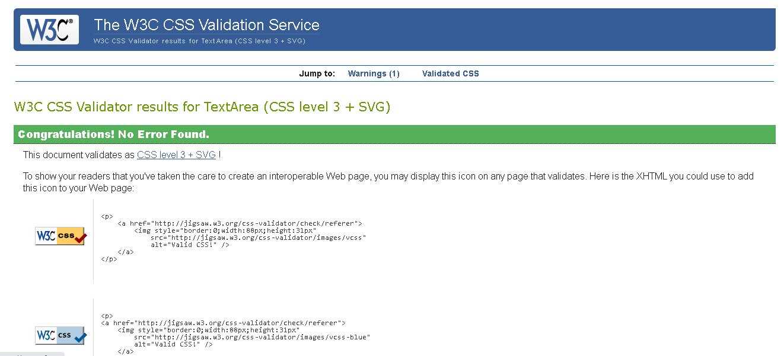
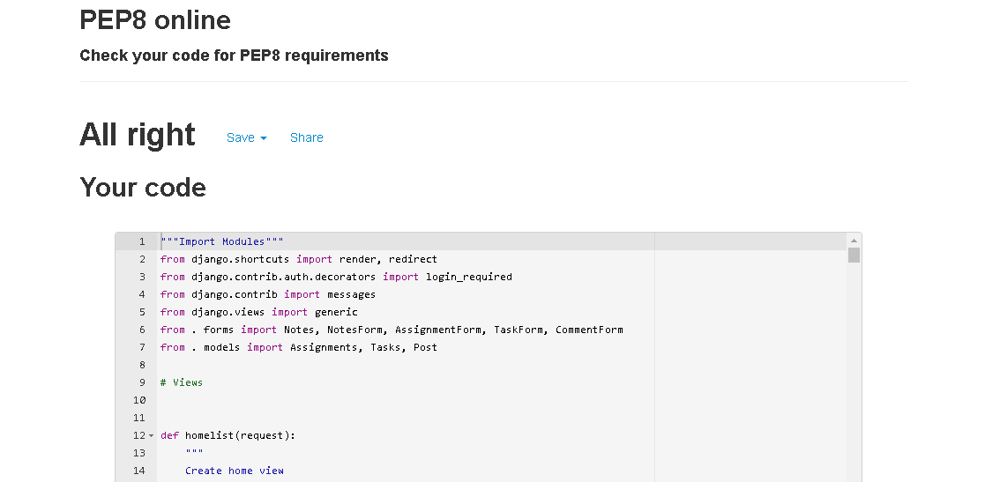
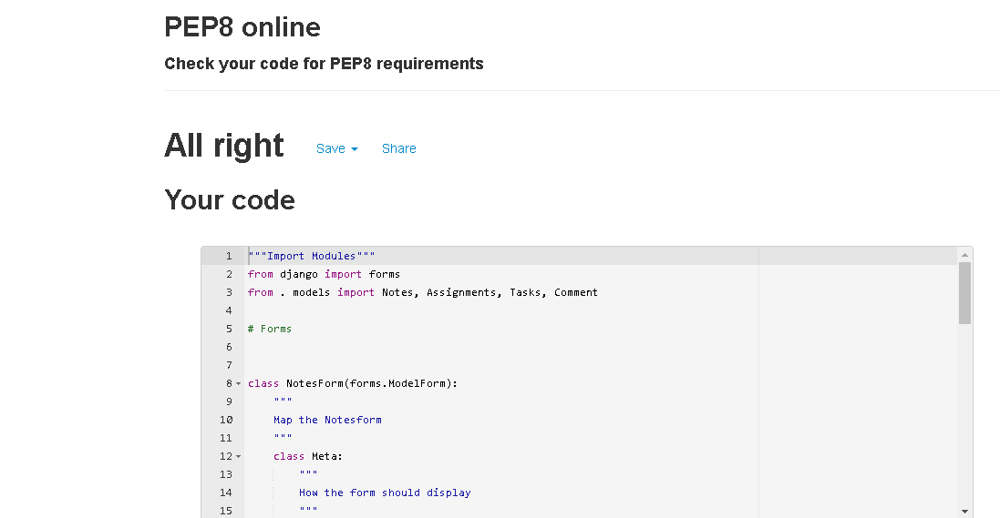
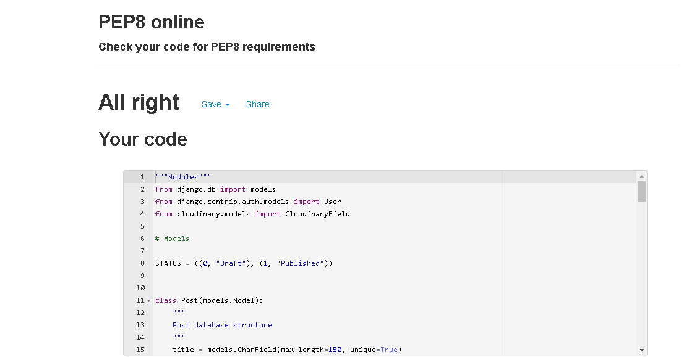
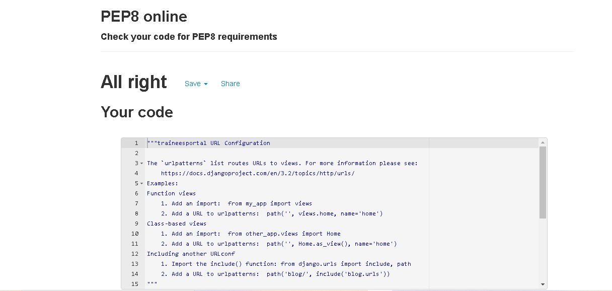
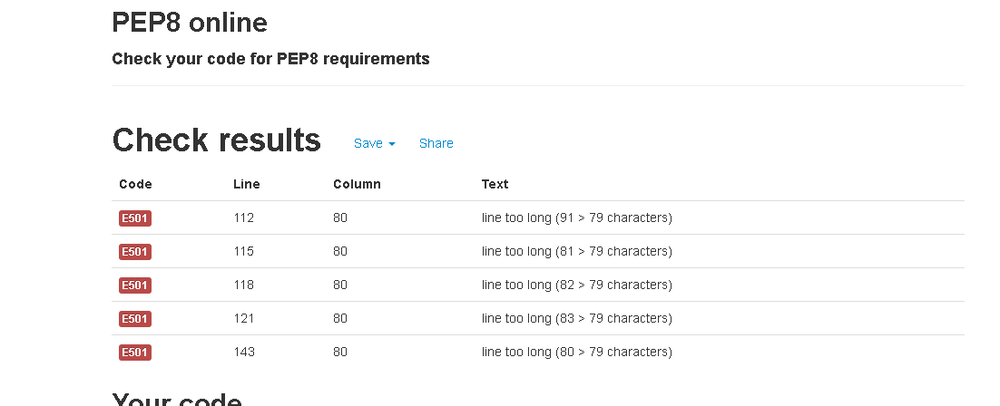

# Trainee Portal - Testing

[Main README.md file](https://github.com/Georgette-Lumbe/traineesportal/blob/main/README.md)

[View live project](https://traineesportal.herokuapp.com/)

[View website in GitHub pages](https://github.com/Georgette-Lumbe/traineesportal)

---

# Table of Contents

1. [Testing User Stories](#testing-user-stories "#Goto testing user stories")
2. [Manual Testing](#manual-testing "#Goto manual testing")

3. [Automated Testing](#automated-testing "#Goto automated testing")
    * [Code Validation](#code-validation "Goto code validation")
    * [Browser Validation](#browser-validation "Goto browser validation")
    * [Lighthouse Auditing](#lighthouse-auditing "Goto lighthouse auditing")

4. [User Testing](#user-testing "Goto user testing")

---

# Testing User Stories

# Manual Testing

## Common Elements Testing

### First Time User goals

* As a first time user, I want to see the main functions of the site

    - When user click on the site, he will see firstly all the main functions on the landing page

* As a first time user, I want to be able to easily navigate throughout the site to find content

    - At the top right, there is a navbar buttons which leads user to each the main options of the site back to the in one click.

    - On each box, there are text as Read More, Notes, assignmenets an task lists that allow the user to go anywhere he wants.

* As a first time user, I want to read the blog post and see the comment

    - There are three blogposts on the bottom of the landing page, on these blogposts, there a Read More button that leads to the blogpost of his choice, then he can read the post.

    - At the bottom of the blogpost, there is a comment area, user can read existing comments and also comment if he want,

### Returning User Goals

* As a returning user, I want the site to be responsive across all devices.

    - The site is created to be responsive across all devices, the user can see the site with a phone, tablet, machine. The user can use the site the same way as on all devices.

* As a returning user, I want to be able to create an account easily.

    - At the top right, the third button `register`, lead the user to the register page
    - The register is simple to fill : write the username, email (optional), create a password and confirm that password.

* As a returning user, I want to be able to creates notes, assignments and tasks

    - At the top right, when the user hits **options**, then he can click on Notes, Assignments and tasks or can hits directly on the Notes, assignments and tasks in the landing page.

    - Once click, user can create his notes, write down assignments and tasks by filling the present form.

* As a returning user, I want to be able to see my profile

    - At the top right, user can hit on the profile that lead to the user profile with all due assignments and tasks.

### Frequent User Goals

* As a frequent user,  I want to be able to login

    - At the top right, the user can hit on the login button that lead to the login page 

    - The login is simple to fill : write the username, and the password.

* As a frequent user, I want to see my notes, assignments and tasks

    - Once the user login, he can see all his notes, tasks and assignments saved in each options.

* As a frequent user, I want to update my assignments and tasks

    - The user can click on mark as completed to update his tasks and assignments.

* As a frequent user, I want to delete my unwanted data

    - The user can click on the trash icon to delete the unwanted delete

* As a frequent user, I want to check to see if there are new blog posts

    - The user can see if there is a new blog post, login or not.

# Manual Testing

## Common Elements Testing

# Automated Testing

## Code Validation

1. W3C Markup Validator service was used to validate the HTML code used.

* base.html

* index.html

* notes.html

* notes_details.html

* assignments.html

* tasks.html

* post_details.html

* profile.html

2. W3C validator CSS service was used to validate the CSS code used.

* style.css

4. P8P online was used to validate the Python code used

* views.py

* models.py

* forms.py

* urls.py(blog)

* urls.py(traineesportal)

* admin.py

* settings.py

There is more details on the Issues and bugs in the README.md file.

## Browser Validation

1. Chrome

2. Edge

3. Opera

4. Firefox

## Lighthouse Auditing

*  Find the desktop and mobile full reports

Desktop

Mobile

# User testing

Family members, Jimmy , were asked to review, test the the site to point out any bugs and issues.

The following changes were made after their testing:

* 
* 

 [Go to top](#testing-user-stories "#Goto testing user stories")